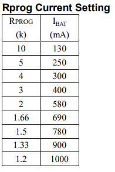

# Hardware
all the codes related to firmware development of this project

### BBB
This folder contains the codes that run on Beaglebone Black.

Currently tested and working:
1. ADC (raw analog data from AIN0) --> Used to monitor the Battery voltage
2. Temperature Sensor DS19B20.

### Notes about TP4056

**Features:**  
- Constant-Current/Constant-Voltage
- Preset 4.2V Charge Voltage with 1.5% Accuracy.
- 2.9V Trickle Charge Threshold

## References
1. [cell specs on robu](https://robu.in/product/lg-inr18650-b4-2600mah-lithium-ion-battery/)
2. [Cell Manual](https://robu.in/wp-content/uploads/2019/04/LG-ICR-18650-22F-Lithium-Ion-Battery-ROBU.IN_.pdf)
3. [TP4056 Datasheet](http://www.tp4056.com/d/tp4056.pdf)
4. [tp4056a pin configurations](https://components101.com/modules/tp4056a-li-ion-battery-chargingdischarging-module)
